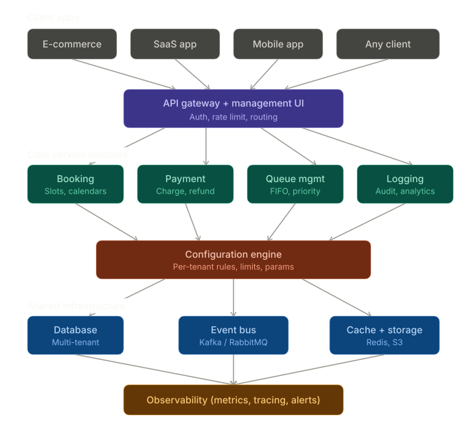

<!--
Copyright (c) 2026, SoftlaneIT (https://softlaneit.com/) All Rights Reserved.

SoftlaneIT licenses this file to you under the Apache License,
Version 2.0 (the "LICENSE"); you may not use this file except
in compliance with the LICENSE.
You may obtain a copy of the LICENSE at

https://softlaneit.com/LICENSE.txt

Unless required by applicable law or agreed to in writing,
software distributed under the LICENSE is distributed on an
"AS IS" BASIS, WITHOUT WARRANTIES OR CONDITIONS OF ANY
KIND, either express or implied. See the LICENSE for the
specific language governing permissions and limitations
under the LICENSE.
-->

# ServiceForge Platform

## Project Identity

- Project name: ServiceForge
- Repository: SoftLaneIT/serviceforge
- Suggested deployable platform repository name: serviceforge-platform
- Product direction: Multi-tenant configurable business capability platform

## Implemented Scaffold (Phase 1)

- Scalable monorepo folder layout
- Go service skeletons for `api-gateway`, `auth-service`, `tenant-service`, `config-service`, and `booking-service`
- Next.js management UI shell in `apps/management-ui`
- Local infrastructure in `deploy/docker/docker-compose.dev.yml` (PostgreSQL, Redis, Kafka)
- Initial OpenAPI contract in `packages/contracts/openapi/booking.v1.yaml`

## Chosen Technology Stack

- Backend services: Go
- Management UI: Next.js + TypeScript
- Multi-tenant data isolation: PostgreSQL with row-level security model
- Event backbone: Kafka
- Cache: Redis
- Deployment target: Kubernetes + Helm + Terraform

## Quick Start

```bash
make up
make auth
make tenant
make config
make booking
make gateway
```

In a separate terminal:

```bash
cd apps/management-ui
npm install
npm run dev
```

---

# SaaS Platform Architecture: Configurable Business Services Platform (ServiceForge)

I'll architect this end-to-end. A platform that provides pre-built business capabilities (booking, payments, queues, etc.) as configurable, subscribable services that developers integrate via APIs and manage via a UI.

---

## 1. Core Concept

Your platform is a **multi-tenant, configurable Business Capability Platform (BCP)**. Clients (who are developers) don't build booking/payment/queue systems from scratch. Instead they:

1. **Subscribe** to capabilities (booking, payment, queue, logging, etc.)
2. **Configure** them via UI or API (e.g., "max 50 bookings/day, payment via Stripe, queue priority: FIFO")
3. **Connect** via generated API endpoints or SDKs
4. **Customize** behavior through parameters — not code

---

## 2. High-Level Architecture



---

## 3. Detailed Architecture — Layer by Layer

### Layer 1: API Gateway + Management Portal

This is the front door. It serves two audiences: the **developer's application** (via REST/GraphQL/webhook endpoints) and the **developer themselves** (via a web-based management UI, like WSO2's publisher/store pattern).

**API Gateway responsibilities:**

* Tenant authentication (API keys, OAuth2, JWT)
* Rate limiting per tenant and per service module
* Request routing to the correct service module
* API versioning and deprecation management
* Request/response transformation and validation
* Usage metering for billing

**Management UI responsibilities:**

* Dashboard showing subscribed services, usage stats, health
* Service catalog — browse available modules (booking, payment, queue, etc.)
* Per-service configuration panels (forms, JSON editors, toggles)
* API key management and webhook configuration
* Billing and plan management
* Logs and event viewer

**Tech choices:** Kong or a custom gateway (built on Express/Fastify + a reverse proxy), React-based admin portal, OpenAPI spec auto-generated per tenant's subscribed modules.

---

### Layer 2: Multi-Tenancy Engine

This is the brain that makes the same service code serve thousands of different tenants with different configurations.

**Tenant isolation model — three strategies (pick based on scale):**

1. **Shared database, separate schemas** — each tenant gets their own schema in a shared PostgreSQL instance. Good for up to \~500 tenants. Cheapest.
2. **Shared database, row-level isolation** — every table has a `tenant_id` column, enforced by Row Level Security (RLS) policies. Scales to thousands. Most common for SaaS.
3. **Separate database per tenant** — maximum isolation, highest cost. Only for enterprise clients with compliance needs.

I'd recommend **option 2 (row-level isolation)** as the default, with option 3 as a premium tier.

**Tenant context propagation:** Every incoming request gets a `tenant_id` injected at the gateway. This ID flows through every service call, database query, cache key, and event message. No service ever operates without knowing which tenant it's acting for.

---

### Layer 3: Core Service Modules

Each module is a self-contained microservice with its own database tables, API surface, event publishers, and configuration schema. Here's the design for each:

#### Booking Module

**What it provides:** Slot-based scheduling, calendar management, availability checking, reservation lifecycle (create → confirm → complete/cancel).

**Configurable parameters (exposed in UI):**

* Max bookings per day/hour/slot
* Slot duration (15min, 30min, 1hr, custom)
* Advance booking window (e.g., "bookable up to 30 days ahead")
* Cancellation policy (free cancel up to X hours before)
* Overbooking percentage allowed
* Buffer time between bookings
* Working hours and blackout dates
* Auto-confirmation vs manual approval

**API surface the client gets:**

* `POST /bookings` — create a booking
* `GET /bookings/availability?date=...` — check slots
* `PUT /bookings/{id}/cancel` — cancel
* `GET /bookings/{id}` — get details
* Webhook: `booking.created`, `booking.cancelled`, `booking.reminded`

#### Payment Module

**What it provides:** Payment processing abstraction over Stripe/PayPal/Razorpay, invoice generation, refund management, subscription billing.

**Configurable parameters:**

* Payment gateway selection (Stripe, PayPal, etc.) — client provides their own API keys
* Currency
* Tax calculation rules
* Partial payment / installment configuration
* Auto-refund rules
* Receipt template customization
* Retry policy for failed charges

**API surface:**

* `POST /payments/charge` — one-time charge
* `POST /payments/subscribe` — recurring billing
* `POST /payments/refund` — process refund
* `GET /payments/{id}` — get payment status
* Webhook: `payment.succeeded`, `payment.failed`, `payment.refunded`

#### Queue Management Module

**What it provides:** Virtual queue positions, estimated wait times, priority management, notifications when it's the customer's turn.

**Configurable parameters:**

* Queue discipline (FIFO, priority-based, weighted)
* Max queue size
* Estimated service time per item
* VIP/priority tiers and rules
* Auto-expiry (remove from queue after X minutes of no-show)
* Notification channels (SMS, email, webhook)
* Operating hours

#### Logging / Audit Module

**What it provides:** Structured logging, audit trails, analytics dashboards, alerting.

**Configurable parameters:**

* Retention period
* Log level filtering
* Custom event types
* Alert rules (e.g., "notify me if payment failures > 5% in an hour")
* Export format (JSON, CSV)

---

### Layer 4: Configuration Engine

This is the heart of "configure, don't code." It stores and applies per-tenant settings for every module.

**How it works:**

Each service module registers a **configuration schema** (a JSON Schema document) that declares what parameters are configurable, their types, defaults, validation rules, and UI hints. For example, the booking module's schema might include:

```
slot_duration:
  type: integer
  default: 30
  min: 5
  max: 480
  unit: minutes
  ui_component: slider

max_bookings_per_day:
  type: integer
  default: 100
  min: 1
  ui_component: number_input

cancellation_policy:
  type: object
  properties:
    free_cancel_hours_before: { type: integer, default: 24 }
    refund_percentage: { type: integer, default: 100, max: 100 }
  ui_component: nested_form
```

The **Management UI auto-generates forms** from this schema (similar to how Swagger UI generates from OpenAPI specs). When a developer changes a setting, the configuration engine validates it against the schema, stores it, and emits a `config.updated` event. The service module picks up the new config — either by polling or subscribing to the event — and applies it without restart (hot reload).

**Configuration hierarchy:** Global defaults → plan-level overrides → tenant-specific overrides. This means you can offer "Starter plan: 50 bookings/day, no priority queue" vs "Pro plan: unlimited bookings, priority queue enabled" while still letting individual tenants customize within their plan limits.

---

### Layer 5: Event Bus + Integration

All modules communicate asynchronously through an event bus (Kafka or RabbitMQ). This is critical because it lets modules work independently while still reacting to each other.

**Example event flow for an e-commerce client:**

1. Customer creates a booking → Booking module emits `booking.created`
2. Payment module listens, charges the customer → emits `payment.succeeded`
3. Queue module listens, assigns queue position → emits `queue.position_assigned`
4. Logging module captures everything → stores audit trail
5. Client's webhook endpoint receives all relevant events

The developer configures which events they care about and where to send them — all through the UI.

---

## 4. How a Developer Uses the Platform

Let me walk through the end-to-end developer experience:

**Step 1: Sign up and create a project.** The developer registers, creates a "project" (their tenant), and gets API keys.

**Step 2: Browse the service catalog.** The management UI shows available modules — booking, payment, queue, logging, notifications, etc. Each has a description, pricing, and sample config.

**Step 3: Subscribe to modules.** The developer enables "Booking" and "Payment" for their project. The platform provisions the necessary resources (database tables, event subscriptions, API routes).

**Step 4: Configure via UI.** For the booking module, they set slot duration to 60 minutes, max bookings to 200/day, and enable auto-confirmation. For payments, they connect their Stripe account and set the currency to USD. No code written.

**Step 5: Integrate.** They get auto-generated API docs specific to their subscriptions. They call `POST /api/v1/bookings` from their app with their API key. That's the only integration code they write — authentication + API calls.

**Step 6: Monitor.** The dashboard shows booking rates, payment success rates, queue lengths, all in real-time.

**Step 7: Customize further.** If they need a custom cancellation rule, they adjust parameters. If they need something the platform doesn't support natively, they use webhooks to receive events and add their own logic on top.

---

## 5. Tech Stack Recommendation


| Layer                | Technology                                     |
| -------------------- | ---------------------------------------------- |
| API Gateway          | Kong / custom (Node.js + Fastify)              |
| Management UI        | React + TypeScript + Tailwind                  |
| Service modules      | Go or Java (for performance) or Node.js        |
| Configuration engine | PostgreSQL (JSONB) + JSON Schema validation    |
| Database             | PostgreSQL with RLS for multi-tenancy          |
| Event bus            | Apache Kafka (for scale) or RabbitMQ (simpler) |
| Cache                | Redis                                          |
| Object storage       | S3/MinIO                                       |
| Auth                 | Keycloak or Auth0 for tenant auth              |
| Observability        | Prometheus + Grafana + ELK stack               |
| Deployment           | Kubernetes with Helm charts per service        |
| CI/CD                | GitHub Actions → ArgoCD                       |

---

## 6. Implementation Roadmap

**Phase 1 (months 1–3): Foundation** Build the multi-tenant core — API gateway, tenant management, auth, the configuration engine, and the management UI shell. Get one module (booking) working end-to-end with full CRUD, configuration via UI, and webhook delivery.

**Phase 2 (months 3–5): Core modules** Add payment module (Stripe integration), queue management, and logging. Build the service catalog UI and subscription workflow. Implement event bus integration between modules.

**Phase 3 (months 5–7): Developer experience** Auto-generated API docs per tenant, SDKs (JavaScript, Python), onboarding wizard, sandbox/test mode, usage analytics dashboard.

**Phase 4 (months 7–9): Scale and monetization** Plan-based billing, rate limiting tiers, tenant isolation improvements, performance optimization, horizontal scaling of service modules.

**Phase 5 (months 9–12): Ecosystem** Plugin/extension system so third parties can build new modules, marketplace for modules, white-label options.

---

## 7. Key Architecture Decisions

**Why configuration engine over a plugin system from day one?** Because your target users want zero coding. A JSON-schema-driven config system gives them UI forms automatically. Plugin systems require code — save that for Phase 5 when power users need extensibility.

**Why event bus between modules?** It decouples everything. If the payment module is slow, the booking module still works. If a client doesn't subscribe to queues, that module never fires. Events also give you a natural audit trail and enable future features (analytics, ML-based insights) without touching core modules.

**Why row-level tenant isolation?** It's the sweet spot between cost and security. Separate schemas add operational overhead. Separate databases are expensive. RLS in PostgreSQL gives you strong isolation with shared infrastructure.

**Why auto-generate API docs per tenant?** If a tenant subscribes to booking + payment but not queues, their API docs should only show booking and payment endpoints. This reduces confusion and makes integration faster.
